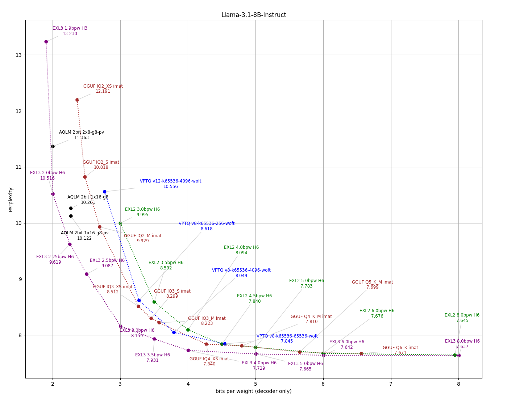

#  ExLlamaV3

This is a ROCm beta fork for ExLlamaV3

You may be looking for [ExllamaV3](https://github.com/turboderp-org/exllamav3) by turboderp.

The environment I am working with is the following:
GMK-Tek Evo2 Ryzen 395+ AI Max (128GB)

### Host OS & toolchain
- Distro: Ubuntu 24.04.4 LTS
- Kernel: Linux 6.17.0-1017-oem (Ubuntu OEM kernel)
- glibc: 2.39
- gcc / g++: 13.3.0
- amdgpu kernel driver: 6.16.13 (DKMS, version 1:6.16.13.30300100-2303411.24.04)

### ROCm
- Version: 7.2.1 (/opt/rocm-7.2.1)
- HIP: 7.2.53211-e1a6bc5663
- AMD clang: 22.0.0git, roc-7.2.1 branch, commit f58b06dce1f9c15707c5f808fd002e18c2accf7e
- HSA Runtime: 1.18.0

### Critical pinned versions:

- torch==2.11.0+rocm7.2          # built against HIP 7.2.26015
- triton==3.5.1
- xformers==0.0.35
- flash_attn==2.8.4              # built natively from in-tree flash-attention/ via CK backend
- numpy==2.4.0rc1
- safetensors==0.7.0
- tokenizers==0.22.1
- setuptools==78.1.0
- ninja==1.13.0
- pybind11==3.0.3

ExLlamaV3 is an inference library for running local LLMs on modern consumer GPUs. Headline features:

- New [EXL3](doc/exl3.md) quantization format based on QTIP
- Flexible tensor-parallel and expert-parallel inference for consumer hardware setups
- OpenAI-compatible server provided via [TabbyAPI](https://github.com/theroyallab/tabbyAPI/) 
- Continuous, dynamic batching
- HF Transformers plugin (see [here](examples/transformers_integration.py))
- HF model support (see [supported architectures](#architecture-support))
- Speculative decoding
- 2-8 bit cache quantization
- Multimodal support

Or so it is supposed to have anyway. This should work on CUDA or ROCm... but it is a beta for ROCm specifically.

The official and recommended backend server for ExLlamaV3 is [TabbyAPI](https://github.com/theroyallab/tabbyAPI/), which provides an OpenAI-compatible API for local or remote inference, with extended features like HF model downloading, embedding model support and support for HF Jinja2 chat templates.

But to use it, you have to uninstall the EXL3 that it pulls, use the venv that they have in TabbyAPI, and then build your ROCm version of this EXL3. But even before that you have to build FlashAttention2 on ROCm first.

### ⚠️ Important
ROCm 7.2.1 is an absolute requirement.
Building FlashAttention2 first on the newest version is also a requirement.
Building FA2 requires rocm develeper tools. If it detects you missing any tools, it should recommend them to you.

Triton fallback will likely fail. I haven't gotten it working on this hardware and I think it is due to PyTorch not being on ROCm 7.2.1.

Some of the normally supported models will not work, I did not test them all.

Gemma4 does not work.

Tensor Parallel is disabled for ROCm.

I have not tested vision capability, this is a beta and I have a GFX1151 Strix Halo, Ryzen 395+ AI Max for dev... so your performance may vary

## Architecture support

- **AFM** (ArceeForCausalLM)
- **Apertus** (ApertursForCausalLM)
- **Command-R** etc. (CohereForCausalLM)
- **Command-A**, **Command-R7B**, **Command-R+** etc. (Cohere2ForCausalLM)
- **DeciLM**, **Nemotron** (DeciLMForCausalLM)
- **dots.llm1** (Dots1ForCausalLM)
- **ERNIE 4.5** (Ernie4_5_ForCausalLM, Ernie4_5_MoeForCausalLM)
- **EXAONE 4.0** (Exaone4ForCausalLM)
- **Gemma 2** (Gemma2ForCausalLM)
- **Gemma 3** (Gemma3ForCausalLM, Gemma3ForConditionalGeneration) *- multimodal*
- **GLM 4**, **GLM 4.5**, **GLM 4.5-Air**, **GLM 4.6** (Glm4ForCausalLM, Glm4MoeForCausalLM)
- **GLM 4.1V**, **GLM 4.5V** (Glm4vForConditionalGeneration, Glm4vMoeForConditionalGeneration) *- multimodal*
- **HyperCLOVAX** (HyperCLOVAXForCausalLM, HCXVisionV2ForCausalLM) *- multimodal*
- **IQuest-Coder** (IQuestCoderForCausalLM)
- **Llama**, **Llama 2**, **Llama 3**, **Llama 3.1-Nemotron** etc. (LlamaForCausalLM)
- **MiMo-RL** (MiMoForCausalLM)
- **MiniMax-M2** (MiniMaxM2ForCausalLM)
- **Mistral**, **Ministral 3**, **Devstral 2** etc. (MistralForCausalLM, Mistral3ForConditionalGeneration) *- multimodal*
- **Mixtral** (MixtralForCausalLM)
- **NanoChat** (NanoChatForCausalLM)
- **Olmo 3.1** (Olmo3ForCausalLM)
- **Olmo-Hybrid** (OlmoHybridForCausalLM)
- **Phi3**, **Phi4** (Phi3ForCausalLM)
- **Qwen 2**, **Qwen 2.5**, **Qwen 2.5 VL** (Qwen2ForCausalLM, Qwen2_5_VLForConditionalGeneration) *- multimodal*
- **Qwen 3** (Qwen3ForCausalLM, Qwen3MoeForCausalLM)
- **Qwen 3-Next** (Qwen3NextForCausalLM)
- **Qwen 3-VL** (Qwen3VLForConditionalGeneration)  *- multimodal*
- **Qwen 3-VL MoE** (Qwen3VLMoeForConditionalGeneration) *- multimodal*
- **Qwen 3.5** (Qwen3_5ForConditionalGeneration) *- multimodal*
- **Qwen 3.5 MoE** (Qwen3_5MoeForConditionalGeneration) *- multimodal*
- **Seed-OSS** (SeedOssForCausalLM)
- **SmolLM** (SmolLM3ForCausalLM)
- **SolarOpen** (SolarOpenForCausalLM)
- **Step 3.5 Flash** (Step3p5ForCausalLM)

Always adding more, stay tuned.


## What's missing?

Currently on the to-do list:

- LoRA support

As for what is implemented, expect that some things may be a VERY broken at first. Please be patient, raise issues and/or contribute. 👉👈 


## How to?

I tried to make it super easy mode:
```
git clone https://github.com/CarouselAether/rocm_exl3/
cd exllamav3
bash scripts/install_rocm.sh
```

Manually:

[PyTorch](https://github.com/pytorch/pytorch) needs to be installed using ROCm 7.2.
I have no reason to believe this will work on windows and if you got ROCm 7.2.1 on Windows with pytorch working, you know what you are doing and more power to you. I'd love to know if it works.

pip3 install torch torchvision --index-url https://download.pytorch.org/whl/rocm7.2

[FlashAttention](https://github.com/Dao-AILab/flash-attention)
You are going ot have to build this on your system in the venv you are testing it in.

If you use TabbyAPI, you are going to have to go into its venv that it installed exllamav3 in and uninstlal it and flash-attn. The build your flash-attn and this rocm_exl3.
[TabbyAPI](https://github.com/theroyallab/tabbyAPI/) has a startup script that manages and installs prerequisites if you want to get started quickly with inference in an OAI-compatible client. 

To install the library for the active venv, run from the repo directory:

```
pip install . --no-build-isolation
```

## Conversion

I would love to know if this can convert well using ROCm. It should by all accounts. If not submit a bug report and I will get to it at some point

To convert a model to EXL3 format, use:

```sh
# Convert model
python convert.py -i <input_dir> -o <output_dir> -w <working_dir> -b <bitrate>

# Resume an interrupted quant job
python convert.py -w <working_dir> -r

# More options
python convert.py -h
```

The working directory is temporary storage for state checkpoints and for storing quantized tensors until the converted model can be compiled. It should have enough free space to store an entire copy of the output model. Note that while EXL2 conversion by default resumes an interrupted job when pointed to an existing folder, EXL3 needs you to explicitly resume with the `-r`/`--resume` argument.    

See [here](doc/convert.md) for more information.


## Examples

A number of example scripts are provided to showcase the features of the backend and generator. Some of them have hardcoded model paths and should be edited before you run them, but there is a simple CLI chatbot that you can start with:

```sh
python examples/chat.py -m <input_dir> -mode <prompt_mode> 

# E.g.:
python examples/chat.py -m /mnt/models/llama3.1-8b-instruct-exl3 -mode llama3

# Wealth of options
python examples/chat.py -h
```

## EXL3 quantization

<div align="center">
    <a href="doc/exl3.md" target="_blank">
        
    </a>
</div>

Despite their amazing achievements, most SOTA quantization techniques remain cumbersome or even prohibitively expensive to use. For instance, **AQLM** quantization of a 70B model takes around **720 GPU-hours** on an A100 server, costing $850 US at the time of writing. ExLlamaV3 aims to address this with the **EXL3** format, which is a streamlined variant of [**QTIP**](https://github.com/Cornell-RelaxML/qtip) from Cornell RelaxML. The conversion process is designed to be simple and efficient and requires only an input model (in HF format) and a target bitrate. By computing Hessians on the fly and thanks to a fused Viterbi kernel, the quantizer can convert a model in a single step, taking a couple of minutes for smaller models, up to a few hours for larger ones (70B+) (on a single RTX 4090 or equivalent GPU.)

The [Marlin](https://github.com/IST-DASLab/marlin)-inspired GEMM kernel achieves roughly memory-bound latency under optimal conditions (4bpw, RTX 4090), though it still needs some work to achieve the same efficiency on Ampere GPUs and to remain memory-bound at lower bitrates.

Since converted models largely retain the original file structure (unlike **EXL2** which renames some tensors in its quest to turn every model into a Llama variant), it will be possible to extend **EXL3** support to other frameworks like HF Transformers and vLLM.

There are some benchmark results [here](doc/exl3.md), and a full writeup on the format is coming soon.

Fun fact: Llama-3.1-70B-EXL3 is coherent at 1.6 bpw. With the output layer quantized to 3 bpw and a 4096-token cache, inference is possible in under 16 GB of VRAM. 


### Community

You are always welcome to join the [ExLlama discord server](https://discord.gg/NSFwVuCjRq) ←🎮  


### 🤗 HuggingFace repos

A selection of EXL3-quantized models is available [here](https://huggingface.co/collections/turboderp/exl3-models-67f2dfe530f05cb9f596d21a). Also shout out the following lovely people:
 
- [ArtusDev](https://huggingface.co/ArtusDev)
- [MikeRoz](https://huggingface.co/MikeRoz) 
- [MetaphoricalCode](https://huggingface.co/MetaphoricalCode) 
- [Ready.Art](https://huggingface.co/ReadyArt) 
- [isogen](https://huggingface.co/isogen/models)


## Acknowledgements

This project owes its existence to a wonderful community of FOSS developers and some very generous supporters (🐈❤️!) The following projects in particular deserve a special mention:

- [ExLlamaV3](https://github.com/turboderp-org/exllamav3) 
- [TabbyAPI](https://github.com/theroyallab/tabbyAPI/)
- [PyTorch](https://github.com/pytorch/pytorch)
- [FlashAttention](https://github.com/Dao-AILab/flash-attention)
- [QTIP](https://github.com/Cornell-RelaxML/qtip)
- [Transformers](https://github.com/huggingface/transformers)
- [Marlin](https://github.com/IST-DASLab/marlin)
- [Flash Linear Attention](https://github.com/fla-org/flash-linear-attention)
