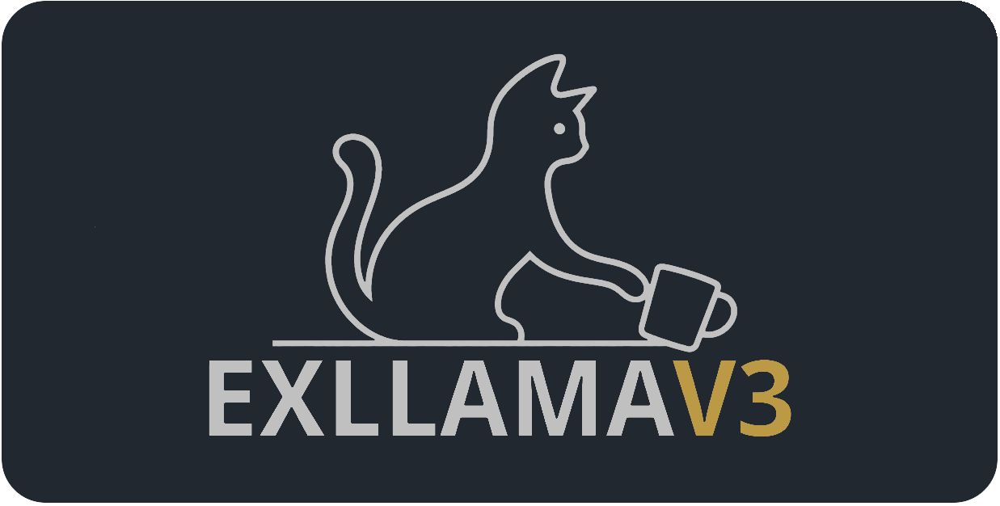
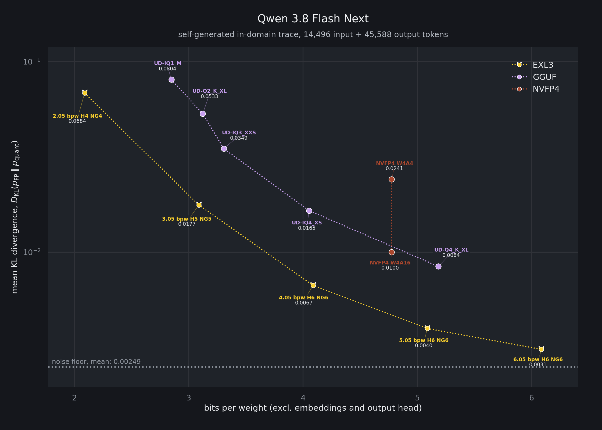
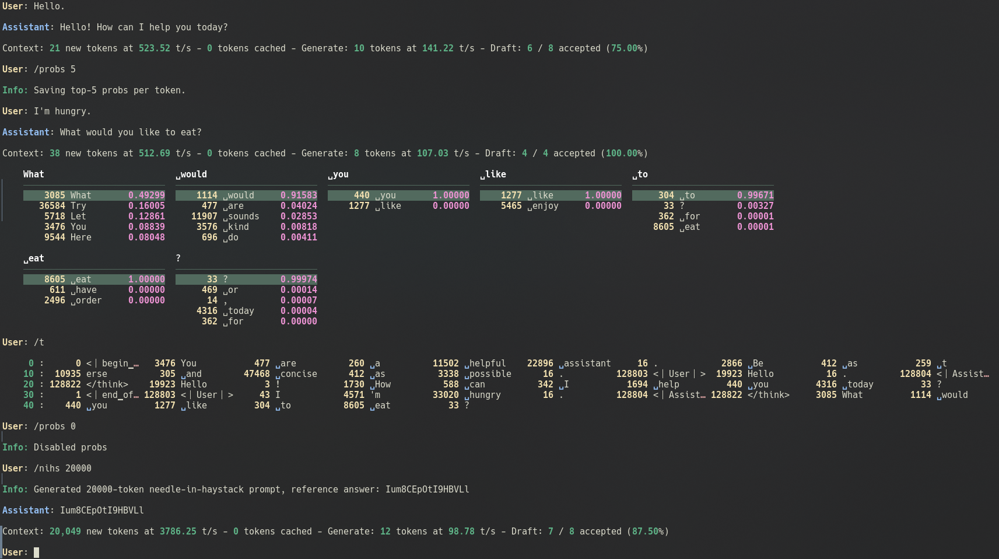

#  ExLlamaV3 — ROCm / RDNA fork

This is a **ROCm fork of [ExLlamaV3](https://github.com/turboderp-org/exllamav3)** by turboderp, tracking
upstream v1.5.0. If you are on NVIDIA, you want [the upstream repo](https://github.com/turboderp-org/exllamav3) —
this one builds for CUDA too, but adds nothing there.

The Python package is still named `exllamav3`, so it is a drop-in replacement for code that imports it. For a
server, use the bundled one (see [Server](#server)).
Only the repository is renamed.

### What this fork changes

The CUDA kernels that cannot compile for RDNA are replaced with hand-written HIP/WMMA siblings under
`exllamav3_ext/rocm/`, reached through a compat shim and include-path redirection. Python divergences live in
`exllamav3/rocm_py/` and are applied as monkeypatches at import.

**No upstream C++ or CUDA source is modified — not one.** Verify it yourself:

```sh
git diff --stat v1.5.0 -- '*.cu' '*.cuh' '*.cpp' '*.h' ':(exclude)exllamav3/exllamav3_ext/rocm'
# (empty)
```

Outside `rocm/`, `rocm_py/` and `rocm_tools/`, exactly four upstream files differ from v1.5.0, plus one added file
(`requirements_rocm.txt`) and one ignore line in `.gitignore`:

| file | change |
|---|---|
| `setup.py` | ROCm backend selector and `hipcc` builder. All ROCm behaviour is inside `HIPBuildExtension`, so a CUDA build is untouched upstream code. |
| `exllamav3/__init__.py` | Six lines calling `rocm_py.apply()` at the end of package init. Returns immediately when `torch.version.hip` is `None`, so it is inert on CUDA. |
| `exllamav3/modules/attention_fn/triton_paged.py` | Selects the narrow-KV prefill tile explicitly on RDNA instead of relying on `get_device_capability()` accidentally reporting `(11, 5)`, plus measured notes on decode split counts. |
| `README.md` | This section. |

```sh
git diff --stat v1.5.0 -- . ':(exclude)exllamav3/exllamav3_ext/rocm' ':(exclude)exllamav3/rocm_py' ':(exclude)rocm_tools'
```

That is the whole surface. Rebasing onto a new upstream means re-applying four files, none of them kernels.

### Requirements

| | |
|---|---|
| ROCm | **7.2.4 or newer** — the build hard-fails below this |
| GPU | RDNA3 / RDNA3.5: `gfx1100`, `gfx1101`, `gfx1102`, `gfx1150`, `gfx1151` — developed and validated on gfx1151. RDNA4 (`gfx1200`, `gfx1201`): builds and should run, but MoE models take a slower per-expert path (the fused MoE kernel's WMMA has no gfx12 encoding) and no RDNA4 hardware has validated the port — reports welcome. |
| Python | 3.10+ (whatever the ROCm torch index publishes a wheel for) |
| Torch | ROCm build, from `download.pytorch.org/whl/rocmX.Y` — see below |

You do **not** need FlashAttention. Upstream uses Triton paged attention, so the FA2 dependency that
earlier ROCm forks required is gone.

### Install

```sh
git clone https://github.com/CarouselAether/rocm_exl3
cd rocm_exl3

# 1. ROCm torch + triton-rocm + everything else.
#    Do NOT use requirements.txt on ROCm -- it resolves torch from PyPI, which is the CUDA build.
pip install -r requirements_rocm.txt

# 2. Build and install the extension against that torch.
pip install --no-build-isolation .
```

`--no-build-isolation` is required, not optional: pip otherwise builds in an isolated environment with no
torch in it, and a torch C++ extension has to be compiled against the same torch it will run against.
Building without it fails with an explanation rather than silently installing an empty package.

The build compiles ~117 sources with `hipcc` in parallel (`MAX_JOBS` to limit it, e.g. on a low-memory
machine).

### Tested

Developed on a Ryzen AI Max 395+ (Strix Halo, **gfx1151**, 128 GB unified) — Ubuntu 24.04, ROCm 7.2.4,
torch 2.13.0+rocm7.2, triton-rocm 3.7.1, Python 3.12. Verified end to end with GLM-4.6V (MoE, 3.55 bpw),
Gemma-4-31B (dense), DeepSeek-V4-Flash (DSA sparse attention, 2.04 bpw) and Qwen 3.8-Flash-Next
(QSA sparse attention + PLE n-gram embeddings + 512-expert MoE, 4 bpw). The other architectures in the
supported list above should work but are untested — reports welcome.

**v1.5.0 sync status (2026-09-20, validated on gfx1151):** the port was brought from v1.4.4 to v1.5.0 by
source-level merge — upstream's own diffs applied to the RDNA siblings, two siblings regenerated, two new
CUDA-only kernels stubbed. Validated end to end on gfx1151: full build, sibling drift audit, numeric ladder
(`mgemv_check`, `test_reconstruct_had`, `test_dsa_kernels` all PASS, pytest suites 161/161), and coherent
generation on the four models in the verified list — including Qwen 3.8-Flash-Next, the architecture this
sync targets. `exllamav3/exllamav3_ext/rocm/RDNA_NOTES.md` lists exactly what changed and what remains
unexercised (the opt-in gates below).

### Known limitations on ROCm

- **Tensor-parallel is not available.** The `parallel/` kernels are excluded from the ROCm build.
- **Vision/multimodal is untested.** Text generation is what has been verified.
- **MoE decode at bsz ≤ 8 runs the per-token `exl3_mgemm` route** (upstream's own v1.4.4 route, reinstated by
  `rocm_py`), not upstream v1.5.0's cooperative decode kernel (`exl3_moe_coop`, inline-PTX GEMV based, not ported).
  On RDNA each call lands on the mgemv fast path; Laguna-S-2.1 4bpw decodes at 21 t/s this way versus 10 through
  the fused `exl3_moe` kernel (`EXL3_ROCM_MOE_MGEMM_ROUTE=0` selects that steer). `EXL3_ROCM_MOE_BSZN=1` restores
  upstream dispatch and raises in the stub.
- **The one-launch sliced Q/K/V bundle is off by default** (`EXL3_ROCM_QKV_SLICE=1` to enable): the sliced mgemm
  mode is ported into the WMMA kernels but unvalidated on RDNA; the pairwise bundles from v1.4.4 are used.
- **RDNA4 (gfx1200/gfx1201) runs MoE through the per-expert path**: the fused MoE kernel's WMMA uses gfx11
  intrinsics that have no gfx12 encoding (LLVM cannot select them), so `rdna_wmma.hip.h` traps on gfx12 and
  `rocm_py` steers MoE off the fused kernel there. Dense models are unaffected. Compile-verified for gfx1201
  (`GPU_ARCH=gfx1201 rocm_tools/hipcc_probe.sh --all`); **never run on real RDNA4 hardware** — testers welcome.
  `EXL3_ROCM_RDNA4_FUSED_MOE=1` re-enables the fused route for a future gfx12 WMMA port.
- **MoE 32/64-row tiles fall back to the 16-row kernel** (same numerics; slower prefill on mul1 MoE models).
- **The batched expert-reconstruct tier is off by default** (`EXL3_ROCM_BATCH_RECON=1` to enable): ported
  mechanically, untested.
- **fp16-accumulate `hgemm` and the sm_120 quantizer specialisations are CUDA-only.** hipBLAS and the original
  quantizer kernels are used; nothing is lost on RDNA, which has no fp32-accumulate rate penalty.
- **The int8-activation GEMV is not ported** (a disabled stub); every call uses the fp16 GEMV/GEMM kernels.
- **HIP graph capture is off by default**: capture/replay corrupts BC decode across generator jobs and can hang at
  capture on ROCm 7.2.x. `EXL3_ROCM_HIP_GRAPHS=1` re-enables it for A/B against newer ROCm stacks.
- **Quantization (`convert.py`) is built but not yet exercised on RDNA.** Convert on CUDA if you can; reports welcome.
- Kernel behaviour can be bisected at runtime with the `EXL3_ROCM_*` environment switches — see
  `exllamav3/rocm_py/__init__.py`, whose module docstring lists each one and why it exists.

### Server

The fork ships its own server: `rocm_tools/exl3_server/server.py`, a single-file, llama.cpp-server-style,
OpenAI-compatible HTTP server. Its dependencies are in `requirements_rocm.txt`. It takes the same model/sampler
flags as `examples/chat.py`, plus a handful of server flags:

```sh
python rocm_tools/exl3_server/server.py -m ~/models/<model>-exl3 -cs 32768 -ngram 2 -dds
# serves on http://127.0.0.1:3953
```

`-ngram 2 -dds` (n-gram drafting, skipped while acceptance is low) is the recommended speculative-decoding setting on
this GPU. See [`rocm_tools/exl3_server/README.md`](rocm_tools/exl3_server/README.md) for flags, endpoints and
measurements.

---
<p align="center">
  
</p>

[Installation](#installation) · [Supported models](#architecture-support) · [Examples](#examples) · [Quantization](#exl3-quantization) · [Community](#community)

ExLlamaV3 is an inference library for running local LLMs on modern consumer GPUs, with flexible quantization and parallel inference.

- **Quantization** - [EXL3](doc/exl3.md), based on QTIP, plus 2–8 bit cache quantization.
- **Parallel inference** - Flexible tensor-parallel and expert-parallel inference for consumer hardware setups.
- **CPU offloading** - Allows large MoE models to run with limited GPU resources. AVX2 and AVX512 support.  
- **Generation** - Continuous, dynamic batching, speculative decoding, multimodal support.
- **Integrations** - Broad [HF model support](#architecture-support), a [Transformers plugin](examples/transformers_integration.py), and an OpenAI-compatible API via the [bundled server](#server).

<p align="center">
  
</p>

## Installation

Start by making sure you have the appropriate version of [PyTorch](https://pytorch.org/get-started/locally/) installed (CUDA 12.4 or later) since the Torch dependency is not automatically handled by `pip`. Then pick a method below:

> **ROCm:** see [Install](#install) at the top of this file. The methods below are upstream's CUDA
> instructions, kept for the CUDA path. There is no prebuilt ROCm wheel; building from source is the ROCm route.

### Prebuilt wheel · recommended

Pick a wheel from the [releases page](https://github.com/turboderp-org/exllamav3/releases), then e.g.:

```sh
pip install https://github.com/turboderp-org/exllamav3/releases/download/v0.0.6/exllamav3-0.0.6+cu128.torch2.8.0-cp313-cp313-linux_x86_64.whl
```

### Install from PyPI

```sh
pip install exllamav3
```
Note that the PyPI package does not contain a prebuilt extension and requires the CUDA toolkit and build prerequisites (i.e. VS Build Tools on Windows, gcc on Linux, `python-dev` headers etc.).

### Build from source

<details>
<summary>Source installation with uv or pip</summary>


`exllamav3` declares a minimum `torch` version (>= 2.6.0) and CUDA version (>= 12.4), but beyond that the user is free to select a version of `torch` that is compatible with their environment.

`torch` can be installed in three ways (from least to most effort):
1. **with `uv`, setting only `--extra cuXXX`** installs `torch` automatically with the specified CUDA version, `torch` version is selected by `uv` from compatible versions in the specific index associated with the chosen CUDA version (options 1 and 2)
2. **with `uv`, creating a thin project that depends on `exllamav3[cuXXX]` and pins a specific `torch` version** — like (1) but `torch` is pinned in the thin project's `pyproject.toml`, see [pinning a specific PyTorch version (optional)](#pinning-a-specific-pytorch-version-optional) for details
3. Manually with `uv pip` or `pip` (options 3 and 4)

The flavor extras (`--extra`) are `cu124`, `cu126`, `cu128`, `cu129`, `cu130`, and `cu132` — pick the one matching your installed CUDA build. Both `uv sync` and `pip install .` build the package in an isolated environment where your `torch` is not visible, so they install the extension sources and compile them at first import (JIT, a few minutes once per torch version). For a precompiled install run `pip install --no-build-isolation .` in an environment that already has `torch`, or use the release wheels. Selecting a flavor installs the matching CUDA build of `torch`.

**Option 1 — Working in the cloned repo directly (`uv sync`):**

```sh
git clone https://github.com/turboderp-org/exllamav3
cd exllamav3
# (Optional) switch to dev branch for latest in-progress features
git checkout dev

uv venv
uv sync --extra cu130
# add --extra examples and/or --extra eval for those extra dependencies
```

**Option 2 — Using `exllamav3` as a dependency from another project (`uv add`):**

```sh
# `uv add` works inside an existing project (a directory with a pyproject.toml).
# `uv init` creates one if you're starting a new project, if integrating into
# an existing project skip `uv init`.
uv init my-project
cd my-project

# local checkout
uv add 'path/to/exllamav3[cu130]'               # non-editable
uv add 'path/to/exllamav3[cu130]' --editable    # editable

# straight from GitHub
uv add 'git+https://github.com/turboderp-org/exllamav3.git[cu130]'                 # default branch
uv add 'git+https://github.com/turboderp-org/exllamav3.git[cu130]' --branch dev    # specific branch
```

**Option 3 — Bring your own `torch` and let `uv` pick the backend automatically:**

```sh
uv venv            # or: uv venv --python-preference only-managed
source .venv/bin/activate
uv pip install torch --torch-backend=auto
uv pip install .
```

`--torch-backend=auto` inspects your system and installs the matching PyTorch CUDA build; see [Automatic backend selection](https://docs.astral.sh/uv/guides/integration/pytorch/#automatic-backend-selection).

**Option 4 — With `pip`:**

On Windows, you also need the `triton-windows` package (declared as a dependency in `pyproject.toml`); the attention, cache and recurrent kernels are Triton and ExLlamaV3 does not import without it.

```sh
# install a CUDA-enabled torch first so it matches your setup, e.g.:
pip install torch --index-url https://download.pytorch.org/whl/cu128
pip install .
```

</details>

ROCm-specific build variables:
- `EXL3_BACKEND`: `cuda` or `rocm`, forcing the backend. Otherwise it follows the installed torch.
- `MAX_JOBS`: also honoured by the ROCm builder, which drives `hipcc` directly. It defaults to a value
  bounded by core count, RAM (~2.5 GB budgeted per job) and a cap of 32, so lower it if you still run out of memory.
- `PYTORCH_ROCM_ARCH` / `GPU_ARCHS`: comma- or space-separated `gfx` list to build for (e.g. `gfx1100,gfx1151`;
  semicolons are *not* separators). An explicit value is used as-is. If unset, the build uses what `rocminfo`
  reports, filtered against the supported list. `PYTORCH_ROCM_ARCH` takes precedence.
- LDS budget: not an environment variable. `setup.py` passes `-DEXL3_RDNA_SMEM_MAX` from the target archs
  (64 KB for Strix / Strix Halo and unknown targets, 90 KB for discrete RDNA3/4, the smallest across a multi-arch
  build), and at runtime it is further clamped to the device's `sharedMemPerBlock`.
- `EXL3_RDNA_MOE_TILESIZE_K`: `32` (default) or `16`. 16 forces the MoE GEMMs onto the single-K path — the
  tile geometry every RDNA shape is validated on — at a cost of roughly 1.4–1.6× MoE throughput. It is the
  first thing to try if fused MoE output ever looks wrong.
- `EXL3_SKIP_ROCM_VERSION_CHECK`: bypass the ROCm >= 7.2.4 requirement. Not advised — older ROCm builds this
  extension successfully and then computes wrong results.

<details>
<summary>Pinning a specific PyTorch version (optional)</summary>

#### Pinning a specific PyTorch version (optional)

The flavor extra picks the *index*, but by default torch resolves to the latest version on that
index that satisfies `>=2.6.0`. To pin a specific torch version while developing on `exllamav3`,
create a **"thin" project** that consumes your local checkout as an editable install and declares
the exact `torch` version itself. This keeps the pin out of the `exllamav3` pyproject, so
you can change the torch version freely without touching the repo.

```
my-exllamav3-dev/          # thin project (uv init)
├── pyproject.toml
└── src/                  # package sources (auto-generated)
```

In `pyproject.toml`:

```toml
[project]
name = "my-exllamav3-dev"
version = "0.1.0"
description = "Dev environment for exllamav3"
requires-python = ">=3.10.11"
dependencies = [
    "exllamav3[cu130]",   # select correct CUDA version
    "torch==2.13.0",      # pin the exact torch version you need
]

[tool.uv.sources]
exllamav3 = { path = "../exllamav3", editable = true }
```

Adjust `../exllamav3` to point at your local checkout, then a plain `uv sync` sets up an
environment with the correct PyTorch index (routed via the `cuXXX` extra),
the pinned version of `torch` from that index (as long as it exists), and an editable install of `exllamav3` so code
changes apply immediately. Switch CUDA flavors by changing the extra (`exllamav3[cu124]`,
`exllamav3[cu128]`, …) and/or the torch pin in the thin project.

Or, if you're installing torch manually with `uv pip install torch` (e.g. as in Option 3 above),
specify the version directly, e.g. `uv pip install "torch==2.11.0" --torch-backend=auto`.

</details>

After installing with one of the options above, you should be able to run the conversion, eval and 
example scripts from the main repo directory, e.g., `uv run python convert.py -i ...` or, for manual
installations once the venv is active, `python convert.py -i ...`

**Build environment variables**

- `MAX_JOBS`: by default ninja may launch too many processes and run out of system memory for 
compilation. Set this to a reasonable value like 4 in that case.
- `EXLLAMA_NOCOMPILE`: set to install the library without compiling the C++/CUDA extension. Torch
will build/load it at runtime instead.

## Examples

A number of example scripts are provided to showcase the features of the backend and generator. 
For instance, a versatile CLI chatbot:

<p align="center">
  
</p>

```sh
python examples/chat.py -m <input_dir> -mode <prompt_mode>

# Wealth of options
python examples/chat.py -h
```

## Architecture support

| Model family                                     | HF architecture | Multimodal | Notes |
|--------------------------------------------------| --- | :---: | --- |
| **AFM**                                          | `ArceeForCausalLM` |  |  |
| **AfMoE**                                        | `AfmoeForCausalLM` |  |  |
| **Apertus**                                      | `ApertursForCausalLM` |  |  |
| **Command-R** etc.                               | `CohereForCausalLM` |  |  |
| **Command-A**, **Command-R+** etc.               | `Cohere2ForCausalLM` |  |  |
| **DeciLM**, **Nemotron**                         | `DeciLMForCausalLM` |  |  |
| **Deepseek V3**                                  | `DeepseekV3ForCausalLM` |  |  |
| **Deepseek V4**                                  | `DeepseekV4ForCausalLM` | ✓ |  |
| **dots.llm1**                                    | `Dots1ForCausalLM` |  | |
| **ERNIE 4.5**                                    | `Ernie4_5_ForCausalLM`<br>`Ernie4_5_MoeForCausalLM` |  |  |
| **EXAONE 4.0**                                   | `Exaone4ForCausalLM` |  |  |
| **Gemma 2**                                      | `Gemma2ForCausalLM` |  |  |
| **Gemma 3**                                      | `Gemma3ForCausalLM`<br>`Gemma3ForConditionalGeneration` | ✓ |  |
| **Gemma 4**                                      | `Gemma4ForConditionalGeneration`<br>`Gemma4UnifiedForConditionalGeneration` | ✓ | E2B/E4B unsupported |
| **GLM 4**, **GLM 4.6**, etc.                     | `Glm4ForCausalLM`<br>`Glm4MoeForCausalLM` |  |  |
| **GLM 4.1V**, **GLM 4.5V**                       | `Glm4vForConditionalGeneration`<br>`Glm4vMoeForConditionalGeneration` | ✓ |  |
| **GLM 4.7 Flash**                                | `Glm4MoeLiteForCausalLM` |  |  |
| **GLM 5.2**                                      | `GlmMoeDsaForCausalLM` |  |  |
| **GLM 5.3-Flash**                                | `Glm5NextForConditionalGeneration` | ✓ |  |
| **GPT-OSS**                                      | `GptOssForCausalLM` |  |  |
| **HyperCLOVAX**                                  | `HyperCLOVAXForCausalLM`<br>`HCXVisionV2ForCausalLM` | ✓ |  |
| **Hy3**                                          | `HYV3ForCausalLM` |  |  |
| **IQuest-Coder**                                 | `IQuestCoderForCausalLM` |  |  |
| **Laguna 2.1**                                   | `LagunaForCausalLM` |  |  |
| **LFM 2.5**                                      | `Lfm2ForCausalLM`<br>`Lfm2MoeForCausalLM` |  |  |
| **Llama 1/2/3**,**3.1-Nemotron** etc.            | `LlamaForCausalLM` |  |  |
| **MiMo-RL**                                      | `MiMoForCausalLM` |  |  |
| **MiniMax-M2**                                   | `MiniMaxM2ForCausalLM` |  |  |
| **Mistral**, **Ministral 3**, **Mistral-4** etc. | `MistralForCausalLM`<br>`Mistral3ForConditionalGeneration` | ✓ |  |
| **Mixtral**                                      | `MixtralForCausalLM` |  |  |
| **NemotronH, Nemotron-3 Nano/Super**              | `NemotronHForCausalLM` |  |  |
| **Olmo 3.1**                                     | `Olmo3ForCausalLM` |  |  |
| **Olmo-Hybrid**                                  | `OlmoHybridForCausalLM` |  |  |
| **Phi3**, **Phi4**                               | `Phi3ForCausalLM` |  |  |
| **Qwen 2**, **Qwen 2.5**, **Qwen 2.5 VL**        | `Qwen2ForCausalLM`<br>`Qwen2_5_VLForConditionalGeneration` | ✓ |  |
| **Qwen 3**                                       | `Qwen3ForCausalLM`<br>`Qwen3MoeForCausalLM` |  |  |
| **Qwen 3-Next**                                  | `Qwen3NextForCausalLM` |  |  |
| **Qwen 3-VL**                                    | `Qwen3VLForConditionalGeneration` | ✓ |  |
| **Qwen 3-VL MoE**                                | `Qwen3VLMoeForConditionalGeneration` | ✓ |  |
| **Qwen 3.5**                                     | `Qwen3_5ForConditionalGeneration` | ✓ |  |
| **Qwen 3.5 MoE**                                 | `Qwen3_5MoeForConditionalGeneration` | ✓ |  |
| **Qwen 3.8-Flash-Next**                          | `Qwen4ExpForConditionalGeneration` | ✓ |  |
| **Seed-OSS**                                     | `SeedOssForCausalLM` |  |  |
| **SmolLM**                                       | `SmolLM3ForCausalLM` |  |  |
| **SolarOpen**                                    | `SolarOpenForCausalLM` |  |  |
| **Step 3.5 Flash**                               | `Step3p5ForCausalLM` |  |  |
| **Step 3.7 Flash**                               | `Step3p7ForConditionalGeneration` | ✓ |  |

Always adding more, stay tuned.

## Conversion

To convert a model to EXL3 format, use:

```sh
# Convert model
python convert.py -i <input_dir> -o <output_dir> -w <working_dir> -b <bitrate>

# Resume an interrupted quant job
python convert.py -w <working_dir> -r

# More options
python convert.py -h
```

The working directory is temporary storage for state checkpoints and for storing quantized tensors 
until the converted model can be compiled. It should have enough free space to store an entire copy 
of the output model.

See the [conversion guide](doc/convert.md) for more information, or the 
[self-calibration guide](doc/optimize.md). 

## EXL3 quantization

EXL3 quantization is a streamlined variant of [**QTIP**](https://github.com/Cornell-RelaxML/qtip) from Cornell RelaxML. It aims to make
SOTA quantization available to users on consumer hardware. The conversion process is designed to be
simple and efficient and requires only an input model (in HF format) and a target bitrate. By
computing Hessians on the fly and thanks to a fused Viterbi kernel, the quantizer can convert a 
model in a single step, taking a couple of minutes for smaller models, up to a few hours for larger
ones (70B+) on a single high-end consumer GPU (see the [conversion guide](doc/convert.md)).

For more information, see the [**QTIP**](https://arxiv.org/abs/2406.11235) and [**QuIP#**](https://arxiv.org/abs/2402.04396) papers, as well as this 
[excellent writeup](https://www.together.ai/blog/even-better-even-faster-quantized-llms-with-qtip) on **QTIP** from together.ai.


## Community

You are always welcome to join the [ExLlama discord server](https://discord.gg/NSFwVuCjRq) ←🎮


### 🤗 Models on Hugging Face

Browse the [EXL3 model collection](https://huggingface.co/collections/turboderp/exl3-models-67f2dfe530f05cb9f596d21a) for quantized models. Also shout out to the following lovely
people:

- [ArtusDev](https://huggingface.co/ArtusDev)
- [MikeRoz](https://huggingface.co/MikeRoz)
- [MetaphoricalCode](https://huggingface.co/MetaphoricalCode)
- [Ready.Art](https://huggingface.co/ReadyArt)
- [isogen](https://huggingface.co/isogen/models)


## Acknowledgements

This project owes its existence to a wonderful community of FOSS developers and some very generous
supporters (🐈❤️!) The following projects in particular deserve a special mention:

- [ExLlamaV3](https://github.com/turboderp-org/exllamav3)
- [PyTorch](https://github.com/pytorch/pytorch)
- [FlashAttention](https://github.com/Dao-AILab/flash-attention)
- [QTIP](https://github.com/Cornell-RelaxML/qtip)
- [Transformers](https://github.com/huggingface/transformers)
- [Marlin](https://github.com/IST-DASLab/marlin)
- [Flash Linear Attention](https://github.com/fla-org/flash-linear-attention) (chunked linear-attention prefill kernels, vendored under `exllamav3/vendor/fla`)

<p align="center">
  
</p>


