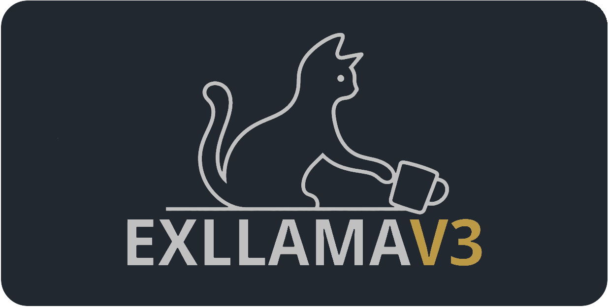
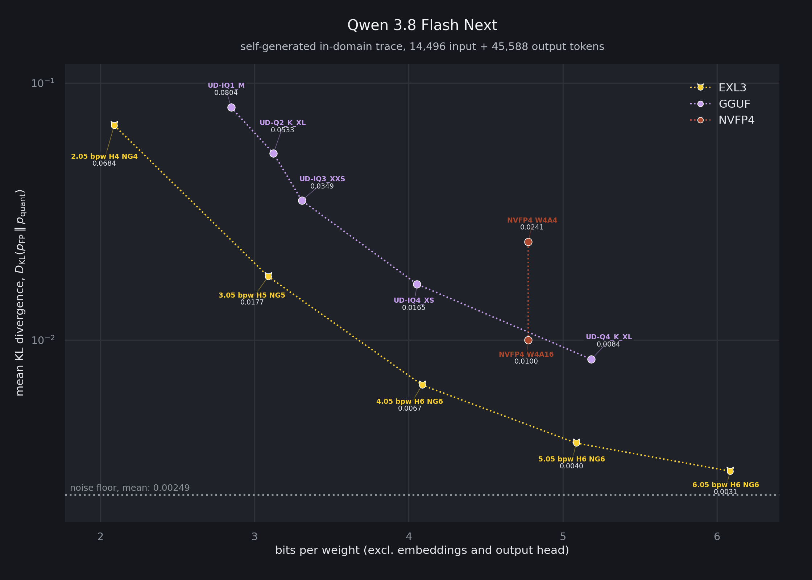
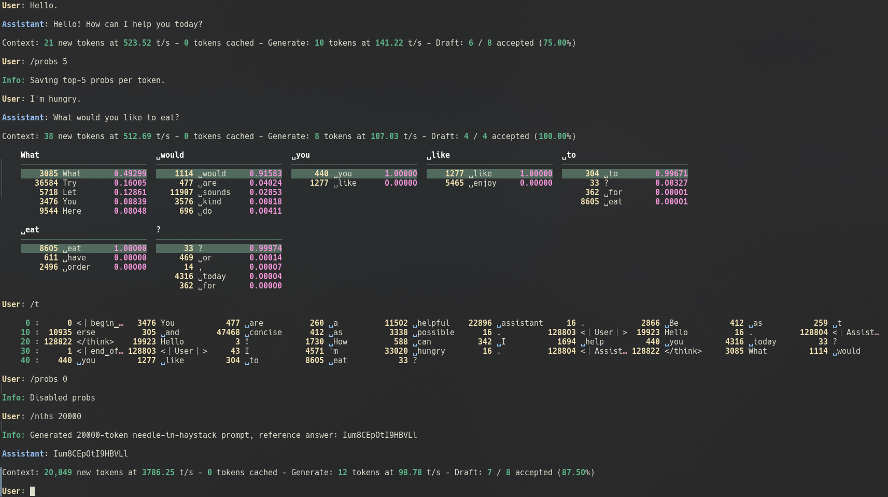

#  ExLlamaV3 — ROCm / RDNA fork

This is a **ROCm fork of [ExLlamaV3](https://github.com/turboderp-org/exllamav3)** by turboderp, tracking
upstream **v1.5.3**. If you are on NVIDIA, you want [the upstream repo](https://github.com/turboderp-org/exllamav3):
this one builds for CUDA too, but adds nothing there.

The Python package is still named `exllamav3`, so it is a drop-in replacement for code that imports it. For a
server, use the bundled one (see [Server](#server)).
Only the repository is renamed.

### What this fork changes

The CUDA kernels that cannot compile for RDNA, or that run poorly on it, are replaced with hand-written
HIP/WMMA siblings under `exllamav3_ext/rocm/`, reached through a compat shim and include-path redirection. The
upstream originals are excluded from the ROCm build (`ROCM_EXCLUDE` in `setup.py`). Python divergences live in
`exllamav3/rocm_py/` and are applied as monkeypatches at import. Every patch is listed in the startup report,
and each has an `EXL3_ROCM_*` switch that restores upstream behaviour.

**No upstream C++ or CUDA source is modified. Not one.** Verify it yourself:

```sh
git diff --stat v1.5.3 -- '*.cu' '*.cuh' '*.cpp' '*.h' ':(exclude)exllamav3/exllamav3_ext/rocm'
# (empty)
```

Outside `rocm/`, `rocm_py/` and `rocm_tools/` (and the fork's own `bench/`, `docs/` and notes), exactly three
upstream files differ from v1.5.3. There is also one added file (`requirements_rocm.txt`) and one ignore line
in `.gitignore`:

| file | change |
|---|---|
| `setup.py` | ROCm backend selector, `hipcc` builder and `ROCM_EXCLUDE`. All ROCm behaviour is inside `HIPBuildExtension`, so a CUDA build is untouched upstream code. |
| `exllamav3/__init__.py` | Six lines calling `rocm_py.apply()` at the end of package init. It returns immediately when `torch.version.hip` is `None`, so it is inert on CUDA. |
| `README.md` | This section. |

```sh
git diff --stat v1.5.3 -- . ':(exclude)exllamav3/exllamav3_ext/rocm' ':(exclude)exllamav3/rocm_py' ':(exclude)rocm_tools' ':(exclude)bench' ':(exclude)docs' ':(exclude)rocm_patches' ':(exclude)*.md'
```

That is the whole surface. Rebasing onto a new upstream means re-applying three files, none of them kernels. The
real work is re-syncing the siblings and hooks whose upstream originals changed. `rocm_patches/` and the
maintainer's merge notes track that. See `RDNA_NOTES.md` → "Syncing to a new upstream release".

### Performance (gfx1151, 2026-09-29)

Ryzen AI Max+ 395, ROCm 10.0, bsz 1. Figures are tok/s, the median of 3 runs. Decode = 128 tokens after a
1024-token natural-text prompt. MTP = the model's own draft head, `-ndt 2`.

| Model | pp512 | pp2048 | decode | decode, MTP |
|---|---|---|---|---|
| DeepSeek-V4-Flash 2.04 bpw | 346 | 519 | 30.0 | 36.9 |
| Qwen 3.8-Flash-Next 4 bpw (`-ngr`) | 621 | 863 | 29.0 | 40.2 |
| GLM-5.3-Flash 2.05 bpw | 262 | 360 | 20.0 | 25.7 |
| Laguna-S-2.1 4 bpw | 582 | 872 | 34.3 | 32.4 (DFlash drafter, ndt 3) |
| MiMo-V2.6-Flash 2.27 bpw | 158 | 274 | 13.2 | 12.1 |
| Gemma-4-31B ~6 bpw (dense) | 249 | 319 | 8.2 | n/a |

Against the port as of v1.5.0 on the same machine, DeepSeek-V4-Flash went from 18.0 to 30.0 t/s decode, from
19.8 to 41.7 t/s with MTP, and from 113 / 179 to 346 / 519 t/s prefill. What changed, with the numerics notes
and per-change A/B, is in `RESULTS.md`; the method is in `PROFILE.md`.

### Requirements

| | |
|---|---|
| ROCm | **10.0 recommended; 7.2.4 minimum.** The build hard-fails below 7.2.4. |
| GPU | RDNA3 / RDNA3.5: `gfx1100`, `gfx1101`, `gfx1102`, `gfx1150`, `gfx1151`. Developed and validated on gfx1151. RDNA4 (`gfx1200`, `gfx1201`): builds and should run, but MoE models take a slower per-expert path (the fused MoE kernel's WMMA has no gfx12 encoding) and no RDNA4 hardware has validated the port. Reports welcome. |
| Python | 3.10+ (whatever the ROCm torch index publishes a wheel for) |
| Torch | A ROCm build matching your ROCm version. See Install. |

**ROCm 7.2.4** (system install, torch 2.13.0+rocm7.2, triton-rocm 3.7.1) remains supported. It builds cleanly,
passes the gate suite and matches ROCm 10 output (perplexity within 0.03%), but it is slower:
- prefill is 3–8% lower;
- DeepSeek-V4-Flash decode is about 10% lower (about 17% with MTP);
- Qwen 3.8 decode is unchanged.

HIP graphs stay off below ROCm 7.14, but graphs on vs off measures flat on ROCm 10, so the gap is the older
compiler and runtime. The details are in `RDNA_NOTES.md`.

You do **not** need FlashAttention. Upstream uses Triton paged attention, so the FA2 dependency that
earlier ROCm forks required is gone.

### Install

**ROCm 10 (recommended).** ROCm 10 ships as pip wheels, so no system ROCm install is needed. Everything goes in
one venv:

```sh
git clone https://github.com/CarouselAether/rocm_exl3
cd rocm_exl3
python -m venv .venv && . .venv/bin/activate

# 1. torch for ROCm 10, plus the ROCm SDK (hipcc and headers) to build against
pip install --pre torch --index-url https://download.pytorch.org/whl/nightly/rocm10.0
pip install "rocm[libraries,devel]==10.0.*"
pip install -r requirements_rocm.txt   # the other dependencies (the installed ROCm 10 torch already satisfies torch>=2.6)
#    (or AMD's stable wheel: pip install --index-url https://stable.repo.amd.com/rocm/whl-next/ "torch[device-gfx1151]==2.13.0+rocm10.0.0")

# 2. Build against that SDK. A login shell's /opt/rocm must not leak in.
SDK=$(rocm-sdk path --root)
env -u LD_LIBRARY_PATH PATH=$SDK/bin:$PATH ROCM_PATH=$SDK ROCM_HOME=$SDK \
    pip install --no-build-isolation .
```

`ROCM_HOME` matters: torch's extension builder takes the runtime path from it. Without it the extension can end up
linked against a system ROCm instead of the wheel's.

**ROCm 7.2.4 (system install):**

```sh
# 1. ROCm torch + triton-rocm + everything else.
#    Do NOT use requirements.txt on ROCm: it resolves torch from PyPI, which is the CUDA build.
pip install -r requirements_rocm.txt

# 2. Build and install the extension against that torch.
pip install --no-build-isolation .
```

`--no-build-isolation` is required, not optional. Otherwise pip builds in an isolated environment with no
torch in it, and a torch C++ extension has to be compiled against the same torch it will run against.
Building without it fails with an explanation rather than silently installing an empty package.

The build compiles ~130 sources with `hipcc` in parallel (`MAX_JOBS` to limit it, e.g. on a low-memory
machine).

### Tested

Developed on a Ryzen AI Max 395+ (Strix Halo, **gfx1151**, 128 GB unified): Ubuntu 24.04, ROCm 10.0 (pip SDK,
HIP 7.15), torch 2.15.0.dev20260926+rocm10.0, triton-rocm 3.8.0, Python 3.12. Also verified on system ROCm 7.2.4
with torch 2.13.0+rocm7.2.

Verified end to end on the models in the performance table: DeepSeek-V4-Flash, Qwen 3.8-Flash-Next,
GLM-5.3-Flash, Laguna-S-2.1 (with its DFlash drafter), MiMo-V2.6-Flash and Gemma-4-31B. GLM-4.6V was verified
at v1.5.0. The other architectures in the supported list should work but are untested. Reports welcome.

**v1.5.3 sync status (2026-09-29, validated on gfx1151):** merged from v1.5.0 (133 upstream commits). Upstream's
changes were ported into every RDNA sibling and `rocm_py` hook whose original changed. Two new CUDA-only kernels
(the int8 deterministic router GEMM and the tiled GatedResidual mix) are declined cleanly. Validation:
- full build, compiling on gfx1151 / 1100 / 1101 / 1200 / 1201;
- the numeric ladder plus a bit-exact WMMA gate;
- pytest: 985 passed;
- perplexity matching v1.5.0 (DS4 −0.02%, Qwen −0.26%, Gemma exact).

**New in upstream v1.5.1–v1.5.3, on ROCm:**

| Feature | Status |
|---|---|
| MiMo-V2 (text, MTP, DFlash drafter) | supported; the vision tower is untested |
| Kimi-Linear | builds; untested (no model) |
| Fractional bitrates (1.5 / 2.5 / 3.5 bpw) | supported (reconstruct, GEMM, mgemm, fused MoE, quantizer). There is no fast GEMV decode path for half rates yet, which is why MiMo-V2.6 at 2.27 bpw decodes slowly. |
| DFlash rework, DFlash2 drafters, n-gram SAM corpus | supported |
| Deterministic router math, GDN fp16 prefill, new paged-decode split | supported; ROCm follows upstream's numerics |
| int8 GEMV, cooperative MoE decode (`exl3_moe_coop`), fp16-accumulate `hgemm` | not ported (CUDA-only); the RDNA kernels are used instead |
| Tensor parallel | not available on ROCm (see below) |

### Known limitations on ROCm

- **Tensor-parallel is not available.** The `parallel/` kernels are excluded from the ROCm build.
- **Vision/multimodal is untested.** Text generation is what has been verified.
- **MoE decode at bsz ≤ 8 uses the fork's own fused decode op** (`torch.ops.exl3_rocm.moe_decode`: gate+up in
  one GEMV, activation folded into down), not upstream's cooperative decode kernel (`exl3_moe_coop`, inline-PTX
  GEMV based, not ported). `EXL3_ROCM_MOE_FUSED=0` / `EXL3_ROCM_MOE_BATCH=0` fall back to the per-token
  `exl3_mgemm` route.
- **The one-launch sliced Q/K/V bundle is off by default** (`EXL3_ROCM_QKV_SLICE=1` to enable). The sliced mgemm
  mode is ported into the WMMA kernels but unvalidated on RDNA; the pairwise bundles are used.
- **RDNA4 (gfx1200/gfx1201) runs MoE through the per-expert path.** The fused MoE kernel's WMMA uses gfx11
  intrinsics that have no gfx12 encoding (LLVM cannot select them), so `rdna_wmma.hip.h` traps on gfx12 and
  `rocm_py` steers MoE off the fused kernel there. Dense models are unaffected. It is compile-verified for gfx1201
  (`GPU_ARCH=gfx1201 rocm_tools/hipcc_probe.sh --all`) but **has never run on real RDNA4 hardware**. Testers
  welcome. `EXL3_ROCM_RDNA4_FUSED_MOE=1` re-enables the fused route for a future gfx12 WMMA port. The WMMA GEMM
  backend also falls back to hipBLAS on gfx12.
- **The batched expert-reconstruct tier is off by default** (`EXL3_ROCM_BATCH_RECON=1` to enable). It was ported
  mechanically and is untested.
- **fp16-accumulate `hgemm`, int8 GEMV and the sm_120 quantizer specialisations are CUDA-only.** On RDNA,
  fp16-output and fp32-output GEMMs run on the fork's WMMA GEMM backend (tuned for gfx1151, with a gfx1100 table)
  or on hipBLAS. The fp32 accumulator is free on RDNA.
- **HIP graph capture is gated on the HIP runtime.** Capture/replay corrupts BC decode across generator jobs and
  can hang at capture on ROCm 7.2.x, so on runtimes older than 7.14 the BC step runs eagerly. On ROCm 7.14 / 10.x
  graphs are on with no flag needed. `EXL3_ROCM_HIP_GRAPHS=1` / `=0` overrides the gate either way. On ROCm 10 the
  speed difference is within noise.
- **gfx11 WMMA fp32 accumulation is not IEEE-exact.** It is 8 sequential DOT2 steps with fixed-point accumulation,
  inherent to the silicon. Results match CUDA within normal tolerance, but not bit for bit. See `docs/RDNA_WMMA.md`.
- **Quantization (`convert.py`) is built but not yet exercised on RDNA.** Convert on CUDA if you can. Reports welcome.
- Kernel behaviour can be bisected at runtime with the `EXL3_ROCM_*` environment switches. See
  `exllamav3/rocm_py/__init__.py`, whose module docstring lists each one and why it exists.

### Server

The fork ships its own server: `rocm_tools/exl3_server/server.py`, a single-file, llama.cpp-server-style,
OpenAI-compatible HTTP server. Its dependencies are in `requirements_rocm.txt`. It takes the same model/sampler
flags as `examples/chat.py` (they come from `exllamav3.model_init.add_args`), plus the server flags below.

```sh
python rocm_tools/exl3_server/server.py -m ~/models/<model>-exl3 -cs 32768 -ngram 2 -dds
# serves on http://127.0.0.1:3953
```

`-ngram 2 -dds` (n-gram drafting, skipped while acceptance is low) is the recommended speculative-decoding setting on
this GPU. Endpoints: `GET /health`, `GET /props`, `GET /v1/models`, `POST /v1/chat/completions` (prompt built with the
model's own chat template), `POST /v1/completions` (prompt used verbatim, for clients that apply their own instruct
template), `POST /tokenize`, `POST /detokenize`. Streaming uses standard OpenAI SSE chunks ending in `data: [DONE]`.
Sampling flags set the *defaults*; each request can override them. See
[`rocm_tools/exl3_server/README.md`](rocm_tools/exl3_server/README.md) for endpoint details, SillyTavern setup and
measurements.

#### All flags

Every flag has a short and a long form; the short form is shown. Run `server.py -h` for the live list.

**Model loading**

| flag | what it does |
|---|---|
| `-m DIR` | model directory (required) |
| `-gs GB[,GB...]` | max VRAM to use per device, in GB; on a single-GPU Strix Halo box this is one number |
| `-lm` | print loader metrics |
| `-or FILE` | tensor override spec (YAML) |
| `-tp` | load in tensor-parallel mode (multi-GPU); respects `-gs` where it can |
| `-tpb native\|nccl` | tensor-parallel backend, default `native` |
| `-tp_attn N`, `-tp_mlp N`, `-tp_moe N`, `-tp_linear N`, `-tp_linear_attn N` | (TP) cap the parallelism of that layer class |
| `-tp_moe_ts` | (TP) tensor-split MoE layers instead of expert parallelism |
| `-swa_full` | use a full cache for sliding-window layers instead of recurrent mode with snapshots |
| `-ambs N` | max batch size to account for when autosplitting, default 4 |
| `-chunk_size N` | max prefill chunk size |
| `-lv` | verbose loading |
| `-asnf` | skip the forward pass during autosplit (debug) |
| `-layer_map SPEC` | RYS layer map, e.g. `0..15,11..31` repeats layers 11-15 once |

**MoE on the CPU** (experimental; layer-split mode only; needs mul1-codebook experts)

| flag | what it does |
|---|---|
| `-mcl N` | run the routed experts of the first N block-sparse MoE layers on the CPU, weights in system RAM |
| `-mcs N` | per-layer split: run the tail N routed experts of every eligible MoE layer on the CPU, overlapped with the GPU experts; dynamic hot/cold placement is on (`EXL3_MOE_CPU_SWAP=0` for static). Mutually exclusive with `-mcl` |
| `-mct N` | worker threads for the two above (default `EXL3_MOE_CPU_THREADS`, else half the cores) |
| `-ngr` | load a PLE model's n-gram embedding table fully into RAM (tens of GB) instead of streaming rows from disk per forward, e.g. Qwen3.8-Flash-Next. See "N-gram table: three modes" below |
| `-ngl` | (server only) like `-ngr`, then lock the table's pages in RAM (`mlock`) so they are never swapped out or reclaimed. Needs `RLIMIT_MEMLOCK` >= the table size; see below |

**N-gram table: three modes** (PLE models such as Qwen3.8-Flash-Next, whose table is ~36 GiB)

| mode | flag | where the table lives | when to use it |
|---|---|---|---|
| disk streaming | *(default)* | stays on disk; each forward reads only the rows it needs (the page cache keeps hot rows) | the default; costs no RAM up front. On a quiet 128 GB box it measured the same speed as `-ngr` (Qwen3.8 tg128 26.7 vs 26.6 t/s, pp and regeneration within noise) because the page cache holds the hot rows |
| RAM | `-ngr` | loaded whole into ordinary process memory | no disk reads at all. The pages are ordinary anonymous memory: with swap on, the kernel may swap parts of the table out under pressure, and a swapped row then costs a page-in inside a forward |
| locked RAM | `-ngl` | loaded like `-ngr` (the same single copy), then `mlock`ed | guarantees the table stays resident: it is never swapped or reclaimed. Only the server has this flag |

`-ngl` checks two things **before** it loads anything, so a refusal takes seconds:
- **Lock limit.** The process's `RLIMIT_MEMLOCK` must cover the table (or the process needs `CAP_IPC_LOCK`). An
  unprivileged process raises its soft limit to the hard limit on its own. If the hard limit is too low, the server
  exits and prints how to raise it: `ulimit -l unlimited` in the launching shell (the hard limit comes from
  `/etc/security/limits.conf`, e.g. `<user> - memlock unlimited`, then log in again); `LimitMEMLOCK=infinity` for a
  systemd service (`DefaultLimitMEMLOCK=` for user sessions); `prlimit --pid <pid> --memlock=unlimited:unlimited` as
  root; or `setcap cap_ipc_lock+ep` on the interpreter.
- **Memory budget.** Model weights + table + KV-cache estimate + headroom must fit in `MemAvailable`. The headroom is
  8 GiB by default (`EXL3_NGRAM_LOCK_HEADROOM_GB`). On Strix Halo the weights are system RAM too. A locked table can
  never be reclaimed, so an over-committed box would end in the OOM killer; the server refuses instead. After the
  load it checks the headroom once more, then locks.

The lock goes onto the tensor the loader already holds, so there is no second copy. The server log prints
`n-gram table locked in RAM: 36.4 GiB ...; VmLck ...`, and `GET /props` reports `ngram_table`
(`disk` / `ram` / `ram_locked`) and `ngram_locked_bytes`. To verify from outside, check `VmLck` in
`/proc/<server pid>/status`. Locking does not change speed: the table is read the same way in both RAM modes.
Implementation: `exllamav3/rocm_py/ngram_lock.py`.

**KV cache**

| flag | what it does |
|---|---|
| `-cs N` | total cache size in tokens. **Default = the model's max context**; long-context models advertise 256K-1M, so pass `-cs` (e.g. `-cs 32768`) or `-cq` to keep the cache sane |
| `-cq BITS` or `-cq K,V` | quantized cache, one bit width for both or separate K and V widths |
| `-cca A` | compand `a` value for the simulated cache, default 0 |
| `-ccs GB` | CPU second-tier cache size, GB |
| `-rcs GB` | recurrent-state second-tier cache size, GB |

**Speculative decoding**

| flag | what it does |
|---|---|
| `-dm DIR` | separate draft model, like llama.cpp's `--model-draft`; DFlash / EAGLE-3-style drafters load directly (e.g. `-dm ~/models/Laguna-S-2.1-DFlash`) |
| `-mtp` | draft with the model's own MTP head (DeepSeek V4, Qwen3.8-Flash-Next, ...); not with `-dm` |
| `-ndt N` | draft tokens per step (default: the draft model's own default, else 4) |
| `-ngram N` | n-gram drafting from repeats already in the context, minimum match length N; no extra model. `-ngram 2` is the cheap default |
| `-dds` | dynamic draft length: skip or shorten drafting while acceptance is low; `-ndt` becomes the ceiling |
| `-dc X` | confidence target for dynamic draft truncation, default 0.4 |
| `-dmcl N` | like `-mcl` for the draft model or MTP head (experimental) |

Draft acceptance is printed per request in the server log and returned in the native `timings` as
`draft_n` / `draft_n_accepted`.

**Sampling defaults** (per-request values override these)

| flag | what it does |
|---|---|
| `-temp X` | temperature, default 0.8 |
| `-temp_first` | apply temperature before truncation |
| `-repp X` | HF-style repetition penalty, 1 disables |
| `-presp X`, `-freqp X` | presence / frequency penalty, 0 disables |
| `-penr N` | range in tokens the penalties look back over, default 1024 (see the note below) |
| `-minp X` | min-P truncation, default 0.08, 0 disables |
| `-topk N` | top-K truncation, 0 disables |
| `-topp X` | top-P truncation, 1 disables |
| `-adaptive_target X`, `-adaptive_decay X` | Adaptive-P target (1 disables) and decay |
| `-xtcp X`, `-xtct X` | XTC probability (0 disables) and threshold (default 0.1) |
| `-drym X`, `-dryb X`, `-dryal N`, `-dryln N` | DRY multiplier (0 disables), base (1.75), allowed repeat length (2), scan range in tokens (-1 = whole context, 0 disables) |

Keep the penalty range bounded: unbounded frequency/presence penalties over a long context were the cause of the
"coherency cliff" around 8K tokens that was once blamed on the kernels.

**Server**

| flag | what it does |
|---|---|
| `-host ADDR`, `-port N` | bind address and port, default `127.0.0.1:3953` |
| `-key KEY` | require this API key (`Authorization: Bearer` or `x-api-key` header) |
| `-smn NAME` | model name reported by the API, default: the model directory name |
| `-maxr N` | server-side cap on tokens per response, default: fill the remaining context |
| `-ctk JSON` | default chat-template kwargs, e.g. `'{"enable_thinking": false}'` |
| `-lw N`, `-lmr N` | loop detection: stop after a window of N tokens repeats `-lmr` times (default 3); `-lw 0` disables |
| `-pcs N` | prompt tokens per prefill forward (Generator chunk size), default 2048. On MoE models every forward streams the whole expert set, so larger chunks prefill faster (DS4 pp2048: 137 / 163 / 181 t/s at 512 / 1024 / 2048). `-chunk_size` only sizes load-time buffers and is raised to match |
| `-nwu` (alias of model_init's `-nw`) | skip the startup warmups: v1.5.3 `model.warmup()` (post-load forward passes) and the server's own two short jobs that absorb Triton JIT / graph capture before the first request; without it the first requests decode at a fraction of the steady rate) |

---
<p align="center">
  
</p>

[Installation](#installation) · [Supported models](#architecture-support) · [Examples](#examples) · [Quantization](#exl3-quantization) · [Community](#community)

ExLlamaV3 is an inference library for running local LLMs on modern consumer GPUs, with flexible quantization and parallel inference.

- **Quantization** - [EXL3](#exl3-quantization), based on QTIP, plus 2–8 bit cache quantization.
- **Parallel inference** - Flexible tensor-parallel and expert-parallel inference for consumer hardware setups.
- **CPU offloading** - Allows large MoE models to run with limited GPU resources. AVX2 and AVX512 support.  
- **Generation** - Continuous, dynamic batching, speculative decoding, multimodal support.
- **Integrations** - Broad [HF model support](#architecture-support), a [Transformers plugin](examples/transformers_integration.py), and an OpenAI-compatible API via the [bundled server](#server).

<p align="center">
  
</p>

## Installation

Start by making sure you have the appropriate version of [PyTorch](https://pytorch.org/get-started/locally/) installed (CUDA 12.4 or later) since the Torch dependency is not automatically handled by `pip`. Then pick a method below:

> **ROCm:** see [Install](#install) at the top of this file. The methods below are upstream's CUDA
> instructions, kept for the CUDA path. There is no prebuilt ROCm wheel; building from source is the ROCm route.

### Prebuilt wheel · recommended

Pick a wheel from the [releases page](https://github.com/turboderp-org/exllamav3/releases), then e.g.:

```sh
pip install https://github.com/turboderp-org/exllamav3/releases/download/v0.0.6/exllamav3-0.0.6+cu128.torch2.8.0-cp313-cp313-linux_x86_64.whl
```

### Install from PyPI

```sh
pip install exllamav3
```
Note that the PyPI package does not contain a prebuilt extension and requires the CUDA toolkit and build prerequisites (i.e. VS Build Tools on Windows, gcc on Linux, `python-dev` headers etc.).

### Build from source

<details>
<summary>Source installation with uv or pip</summary>


`exllamav3` declares a minimum `torch` version (>= 2.6.0) and CUDA version (>= 12.4), but beyond that the user is free to select a version of `torch` that is compatible with their environment.

`torch` can be installed in three ways (from least to most effort):
1. **with `uv`, setting only `--extra cuXXX`** installs `torch` automatically with the specified CUDA version, `torch` version is selected by `uv` from compatible versions in the specific index associated with the chosen CUDA version (options 1 and 2)
2. **with `uv`, creating a thin project that depends on `exllamav3[cuXXX]` and pins a specific `torch` version** — like (1) but `torch` is pinned in the thin project's `pyproject.toml`, see [pinning a specific PyTorch version (optional)](#pinning-a-specific-pytorch-version-optional) for details
3. Manually with `uv pip` or `pip` (options 3 and 4)

The flavor extras (`--extra`) are `cu124`, `cu126`, `cu128`, `cu129`, `cu130`, and `cu132` — pick the one matching your installed CUDA build. Both `uv sync` and `pip install .` build the package in an isolated environment where your `torch` is not visible, so they install the extension sources and compile them at first import (JIT, a few minutes once per torch version). For a precompiled install run `pip install --no-build-isolation .` in an environment that already has `torch`, or use the release wheels. Selecting a flavor installs the matching CUDA build of `torch`.

**Option 1 — Working in the cloned repo directly (`uv sync`):**

```sh
git clone https://github.com/turboderp-org/exllamav3
cd exllamav3
# (Optional) switch to dev branch for latest in-progress features
git checkout dev

uv venv
uv sync --extra cu130
# add --extra examples and/or --extra eval for those extra dependencies
```

**Option 2 — Using `exllamav3` as a dependency from another project (`uv add`):**

```sh
# `uv add` works inside an existing project (a directory with a pyproject.toml).
# `uv init` creates one if you're starting a new project, if integrating into
# an existing project skip `uv init`.
uv init my-project
cd my-project

# local checkout
uv add 'path/to/exllamav3[cu130]'               # non-editable
uv add 'path/to/exllamav3[cu130]' --editable    # editable

# straight from GitHub
uv add 'git+https://github.com/turboderp-org/exllamav3.git[cu130]'                 # default branch
uv add 'git+https://github.com/turboderp-org/exllamav3.git[cu130]' --branch dev    # specific branch
```

**Option 3 — Bring your own `torch` and let `uv` pick the backend automatically:**

```sh
uv venv            # or: uv venv --python-preference only-managed
source .venv/bin/activate
uv pip install torch --torch-backend=auto
uv pip install .
```

`--torch-backend=auto` inspects your system and installs the matching PyTorch CUDA build; see [Automatic backend selection](https://docs.astral.sh/uv/guides/integration/pytorch/#automatic-backend-selection).

**Option 4 — With `pip`:**

On Windows, you also need the `triton-windows` package (declared as a dependency in `pyproject.toml`); the attention, cache and recurrent kernels are Triton and ExLlamaV3 does not import without it.

```sh
# install a CUDA-enabled torch first so it matches your setup, e.g.:
pip install torch --index-url https://download.pytorch.org/whl/cu128
pip install .
```

</details>

ROCm-specific build variables:
- `EXL3_BACKEND`: `cuda` or `rocm`, forcing the backend. Otherwise it follows the installed torch.
- `MAX_JOBS`: also honoured by the ROCm builder, which drives `hipcc` directly. It defaults to a value
  bounded by core count, RAM (~2.5 GB budgeted per job) and a cap of 32, so lower it if you still run out of memory.
- `PYTORCH_ROCM_ARCH` / `GPU_ARCHS`: comma- or space-separated `gfx` list to build for (e.g. `gfx1100,gfx1151`;
  semicolons are *not* separators). An explicit value is used as-is. If unset, the build uses what `rocminfo`
  reports, filtered against the supported list. `PYTORCH_ROCM_ARCH` takes precedence.
- LDS budget: not an environment variable. `setup.py` passes `-DEXL3_RDNA_SMEM_MAX` from the target archs
  (64 KB for Strix / Strix Halo and unknown targets, 90 KB for discrete RDNA3/4, the smallest across a multi-arch
  build), and at runtime it is further clamped to the device's `sharedMemPerBlock`.
- `EXL3_RDNA_MOE_TILESIZE_K`: `32` (default) or `16`. 16 forces the MoE GEMMs onto the single-K path — the
  tile geometry every RDNA shape is validated on — at a cost of roughly 1.4–1.6× MoE throughput. It is the
  first thing to try if fused MoE output ever looks wrong.
- `EXL3_SKIP_ROCM_VERSION_CHECK`: bypass the ROCm >= 7.2.4 requirement. Not advised — older ROCm builds this
  extension successfully and then computes wrong results.

<details>
<summary>Pinning a specific PyTorch version (optional)</summary>

#### Pinning a specific PyTorch version (optional)

The flavor extra picks the *index*, but by default torch resolves to the latest version on that
index that satisfies `>=2.6.0`. To pin a specific torch version while developing on `exllamav3`,
create a **"thin" project** that consumes your local checkout as an editable install and declares
the exact `torch` version itself. This keeps the pin out of the `exllamav3` pyproject, so
you can change the torch version freely without touching the repo.

```
my-exllamav3-dev/          # thin project (uv init)
├── pyproject.toml
└── src/                  # package sources (auto-generated)
```

In `pyproject.toml`:

```toml
[project]
name = "my-exllamav3-dev"
version = "0.1.0"
description = "Dev environment for exllamav3"
requires-python = ">=3.10.11"
dependencies = [
    "exllamav3[cu130]",   # select correct CUDA version
    "torch==2.13.0",      # pin the exact torch version you need
]

[tool.uv.sources]
exllamav3 = { path = "../exllamav3", editable = true }
```

Adjust `../exllamav3` to point at your local checkout, then a plain `uv sync` sets up an
environment with the correct PyTorch index (routed via the `cuXXX` extra),
the pinned version of `torch` from that index (as long as it exists), and an editable install of `exllamav3` so code
changes apply immediately. Switch CUDA flavors by changing the extra (`exllamav3[cu124]`,
`exllamav3[cu128]`, …) and/or the torch pin in the thin project.

Or, if you're installing torch manually with `uv pip install torch` (e.g. as in Option 3 above),
specify the version directly, e.g. `uv pip install "torch==2.11.0" --torch-backend=auto`.

</details>

After installing with one of the options above, you should be able to run the conversion, eval and 
example scripts from the main repo directory, e.g., `uv run python convert.py -i ...` or, for manual
installations once the venv is active, `python convert.py -i ...`

**Build environment variables**

- `MAX_JOBS`: by default ninja may launch too many processes and run out of system memory for 
compilation. Set this to a reasonable value like 4 in that case.
- `EXLLAMA_NOCOMPILE`: set to install the library without compiling the C++/CUDA extension. Torch
will build/load it at runtime instead.
- `EXLLAMA_EXT_LINEINFO`, `EXLLAMA_EXT_COMPRESS`: see [doc/env_vars.md](doc/env_vars.md).

## Examples

A number of example scripts are provided to showcase the features of the backend and generator. 
For instance, a versatile CLI chatbot:

<p align="center">
  
</p>

```sh
python examples/chat.py -m <input_dir> -mode <prompt_mode>

# Wealth of options
python examples/chat.py -h
```

## Architecture support

| Model family                                     | HF architecture | Multimodal | Notes |
|--------------------------------------------------| --- | :---: | --- |
| **AFM**                                          | `ArceeForCausalLM` |  |  |
| **AfMoE**                                        | `AfmoeForCausalLM` |  |  |
| **Apertus**                                      | `ApertursForCausalLM` |  |  |
| **Command-R** etc.                               | `CohereForCausalLM` |  |  |
| **Command-A**, **Command-R+** etc.               | `Cohere2ForCausalLM` |  |  |
| **DeciLM**, **Nemotron**                         | `DeciLMForCausalLM` |  |  |
| **Deepseek V3**                                  | `DeepseekV3ForCausalLM` |  |  |
| **Deepseek V4**                                  | `DeepseekV4ForCausalLM` | ✓ |  |
| **dots.llm1**                                    | `Dots1ForCausalLM` |  | |
| **ERNIE 4.5**                                    | `Ernie4_5_ForCausalLM`<br>`Ernie4_5_MoeForCausalLM` |  |  |
| **EXAONE 4.0**                                   | `Exaone4ForCausalLM` |  |  |
| **Gemma 2**                                      | `Gemma2ForCausalLM` |  |  |
| **Gemma 3**                                      | `Gemma3ForCausalLM`<br>`Gemma3ForConditionalGeneration` | ✓ |  |
| **Gemma 4**                                      | `Gemma4ForConditionalGeneration`<br>`Gemma4UnifiedForConditionalGeneration` | ✓ | E2B/E4B unsupported |
| **GLM 4**, **GLM 4.6**, etc.                     | `Glm4ForCausalLM`<br>`Glm4MoeForCausalLM` |  |  |
| **GLM 4.1V**, **GLM 4.5V**                       | `Glm4vForConditionalGeneration`<br>`Glm4vMoeForConditionalGeneration` | ✓ |  |
| **GLM 4.7 Flash**                                | `Glm4MoeLiteForCausalLM` |  |  |
| **GLM 5.2**                                      | `GlmMoeDsaForCausalLM` |  |  |
| **GLM 5.3-Flash**                                | `Glm5NextForConditionalGeneration` | ✓ |  |
| **GPT-OSS**                                      | `GptOssForCausalLM` |  |  |
| **HyperCLOVAX**                                  | `HyperCLOVAXForCausalLM`<br>`HCXVisionV2ForCausalLM` | ✓ |  |
| **Hy3**                                          | `HYV3ForCausalLM` |  |  |
| **IQuest-Coder**                                 | `IQuestCoderForCausalLM` |  |  |
| **Kimi Linear**                                  | `KimiLinearForCausalLM` |  |  |
| **Laguna 2.1**                                   | `LagunaForCausalLM` |  |  |
| **LFM 2.5**                                      | `Lfm2ForCausalLM`<br>`Lfm2MoeForCausalLM` |  |  |
| **Llama 1/2/3**,**3.1-Nemotron** etc.            | `LlamaForCausalLM` |  |  |
| **MiMo-RL**                                      | `MiMoForCausalLM` |  |  |
| **MiMo-V2.6-Flash**                              | `MiMoV2ForCausalLM` | ✓ | no audio |
| **MiniMax-M2**                                   | `MiniMaxM2ForCausalLM` |  |  |
| **Mistral**, **Ministral 3**, **Mistral-4** etc. | `MistralForCausalLM`<br>`Mistral3ForConditionalGeneration` | ✓ |  |
| **Mixtral**                                      | `MixtralForCausalLM` |  |  |
| **NemotronH, Nemotron-3 Nano/Super**              | `NemotronHForCausalLM` |  |  |
| **Olmo 3.1**                                     | `Olmo3ForCausalLM` |  |  |
| **Olmo-Hybrid**                                  | `OlmoHybridForCausalLM` |  |  |
| **Phi3**, **Phi4**                               | `Phi3ForCausalLM` |  |  |
| **Qwen 2**, **Qwen 2.5**, **Qwen 2.5 VL**        | `Qwen2ForCausalLM`<br>`Qwen2_5_VLForConditionalGeneration` | ✓ |  |
| **Qwen 3**                                       | `Qwen3ForCausalLM`<br>`Qwen3MoeForCausalLM` |  |  |
| **Qwen 3-Next**                                  | `Qwen3NextForCausalLM` |  |  |
| **Qwen 3-VL**                                    | `Qwen3VLForConditionalGeneration` | ✓ |  |
| **Qwen 3-VL MoE**                                | `Qwen3VLMoeForConditionalGeneration` | ✓ |  |
| **Qwen 3.5**                                     | `Qwen3_5ForConditionalGeneration` | ✓ |  |
| **Qwen 3.5 MoE**                                 | `Qwen3_5MoeForConditionalGeneration` | ✓ |  |
| **Qwen 3.8-Flash-Next**                          | `Qwen4ExpForConditionalGeneration` | ✓ |  |
| **Seed-OSS**                                     | `SeedOssForCausalLM` |  |  |
| **SmolLM**                                       | `SmolLM3ForCausalLM` |  |  |
| **SolarOpen**                                    | `SolarOpenForCausalLM` |  |  |
| **Step 3.5 Flash**                               | `Step3p5ForCausalLM` |  |  |
| **Step 3.7 Flash**                               | `Step3p7ForConditionalGeneration` | ✓ |  |

Always adding more, stay tuned.

## Conversion

To convert a model to EXL3 format, use:

```sh
# Convert model
python convert.py -i <input_dir> -o <output_dir> -w <working_dir> -b <bitrate>

# Resume an interrupted quant job
python convert.py -w <working_dir> -r

# More options
python convert.py -h
```

The working directory is temporary storage for state checkpoints and for storing quantized tensors 
until the converted model can be compiled. It should have enough free space to store an entire copy 
of the output model.

See the [conversion guide](doc/convert.md) for more information, or the 
[self-calibration guide](doc/optimize.md). 

## EXL3 quantization

EXL3 quantization is a streamlined variant of [**QTIP**](https://github.com/Cornell-RelaxML/qtip) from Cornell RelaxML. It aims to make
SOTA quantization available to users on consumer hardware. The conversion process is designed to be
simple and efficient and requires only an input model (in HF format) and a target bitrate. By
computing Hessians on the fly and thanks to a fused Viterbi kernel, the quantizer can convert a 
model in a single step, taking a couple of minutes for smaller models, up to a few hours for larger
ones (70B+) on a single high-end consumer GPU (see the [conversion guide](doc/convert.md)).

For more information, see the [**QTIP**](https://arxiv.org/abs/2406.11235) and [**QuIP#**](https://arxiv.org/abs/2402.04396) papers, as well as this 
[excellent writeup](https://www.together.ai/blog/even-better-even-faster-quantized-llms-with-qtip) on **QTIP** from together.ai.


## Community

You are always welcome to join the [ExLlama discord server](https://discord.gg/NSFwVuCjRq) ←🎮


### 🤗 Models on Hugging Face

Browse the [EXL3 model collection](https://huggingface.co/collections/turboderp/exl3-models-67f2dfe530f05cb9f596d21a) for quantized models. Also shout out to the following lovely
people:

- [ArtusDev](https://huggingface.co/ArtusDev)
- [MikeRoz](https://huggingface.co/MikeRoz)
- [MetaphoricalCode](https://huggingface.co/MetaphoricalCode)
- [Ready.Art](https://huggingface.co/ReadyArt)
- [isogen](https://huggingface.co/isogen/models)


## Acknowledgements

This project owes its existence to a wonderful community of FOSS developers and some very generous
supporters (🐈❤️!) The following projects in particular deserve a special mention:

- [ExLlamaV3](https://github.com/turboderp-org/exllamav3)
- [PyTorch](https://github.com/pytorch/pytorch)
- [FlashAttention](https://github.com/Dao-AILab/flash-attention)
- [QTIP](https://github.com/Cornell-RelaxML/qtip)
- [Transformers](https://github.com/huggingface/transformers)
- [Marlin](https://github.com/IST-DASLab/marlin)
- [Flash Linear Attention](https://github.com/fla-org/flash-linear-attention) (chunked linear-attention prefill kernels, vendored under `exllamav3/vendor/fla`)

<p align="center">
  
</p>


